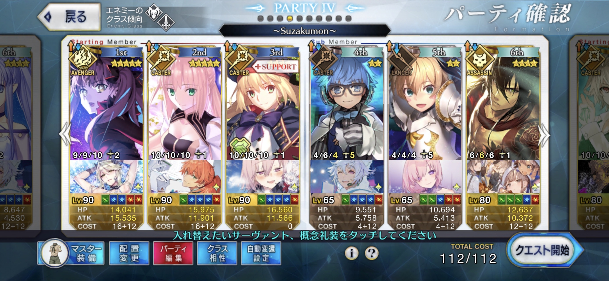

# Demon Flame Lantern

<table>
	<tr>
		<td>Material</td>
		<td>
			
		</td>
	</tr>
	<tr>
		<td>Singularity/Lostbelt</td>
		<td>Heian-kyo</td>
	</tr>
	<tr>
		<td>Quest Name</td>
		<td>Suzakumon 朱雀門</td>
	</tr>
</table>

## Summer Jeanne (3x) + David - updated 28 Mar 2021

### Composition

Mystic Code: Not used

| Servant            | NP Level | Skill Levels | Craft Essence           |
| ------------------ | -------- | ------------ | ----------------------- |
| Summer Jeanne      | NP 2     | 10/10/-      | Kaleidoscope (Level 51) |
| David              | NP 5     | -/-/-        | Kaleidoscope (Level 20) |
| Castoria (Support) | -        | 10/10/10     | -                       |

### Actions

| Wave | Skills                            | NPs                  |
| ---- | --------------------------------- | -------------------- |
| 1    | Jeanne 1, Castoria 23 (on Jeanne) | Jeanne NP            |
| 2    | Castoria 1                        | Jeanne NP            |
| 3    | Jeanne 2                          | Jeanne NP + David NP |

### Notes

The 200k HP boss has Earth trait, while David has Sky trait, giving a 1.1x damage multiplier. Also, the boss has Giant trait, which causes David to do 2x damage multiplier.

After Jeanne's NP, there is about 120k HP left on the boss, and in this case, without Jeanne's and David's attack buffs, David already does 170k damage. If you don't mind pressing the attack buffs you can probably substitute David with another ST servant.

[[Back to main page]](../main.md)

## Space Ishtar (3x) - updated 3 Feb 2021

### Composition

Mystic Code: Chaldea Pathfinder, Lvl 1

| Servant                | NP Level | Skill Levels | Craft Essence          |
| ---------------------- | -------- | ------------ | ---------------------- |
| Space Ishtar (Astarte) | NP 2     | 9/9/10       | Royal Icing (Level 95) |
| Castoria               | NP 1     | 10/10/10     | -                      |
| Castoria (Support)     | -        | 10/10/10     | -                      |

### Actions

| Wave | Skills                                                       | NPs        |
| ---- | ------------------------------------------------------------ | ---------- |
| 1    | Astarte 1, Castoria 123 (on Astarte), 2nd Castoria 123 (on Astarte) | Astarte NP |
| 2    | MC 3 (on Astarte)                                            | Astarte NP |
| 3    | Astarte 23                                                   | Astarte NP |

### Notes

Only got Astarte during Saber Wars II rerun, so bond level is still relatively low

[[Back to main page]](../main.md)