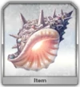

# Seashell

<table>
	<tr>
		<td>Material</td>
		<td>
			
		</td>
	</tr>
	<tr>
		<td>Location</td>
		<td>Babylonia - Observatory</td>
	</tr>
</table>

## Summer Jeanne (2x) + Gilgamesh (1x) - updated 3 Feb 2021

### Composition

Arctic Mystic Code, Level 6

| Servant         | NP Level | Skill Levels | Craft Essence                 |
| --------------- | -------- | ------------ | ----------------------------- |
| Summer Jeanne   | NP 1     | 10/10/10     | Kaleidoscope (Level 40)       |
| Gilgamesh       | NP 1     | 10/10/10     | Holy Night Supper (Level 100) |
| Waver (Support) | -        | -/-/10       | -                             |

### Actions

| Wave | Skills                            | NPs                                    |
| ---- | --------------------------------- | -------------------------------------- |
| 1    | Jeanne 13, Gilgamesh 13, Waver 23 | Jeanne NP                              |
| 2    | Jeanne 2, Waver 1 (on Jeanne)     | Jeanne NP                              |
| 3    | MC 2 (on Gilgamesh)               | Gilgamesh NP + 20-30k face card damage |

### Notes

Jeanne NP gives 10 star regen per turn for 3 turns at base overcharge. This means at turn 3, there will be at least 20 stars.

[[Back to main page]](../main.md)